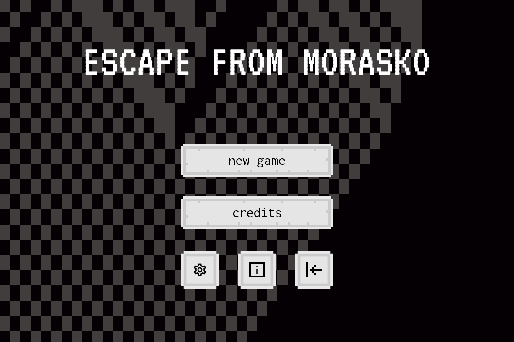
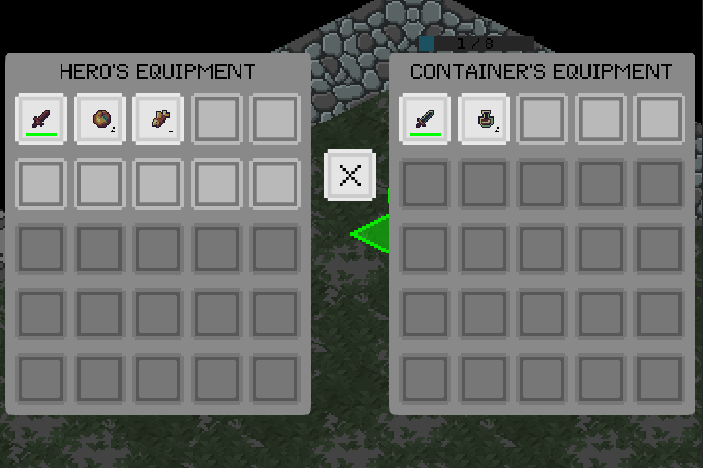
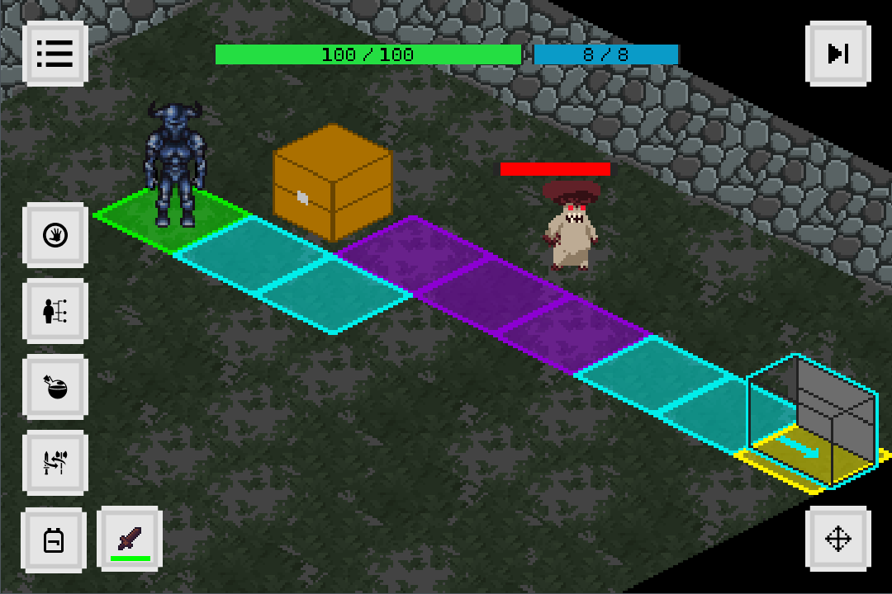
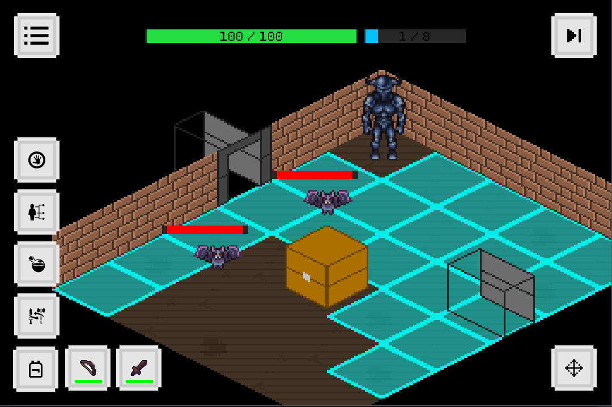
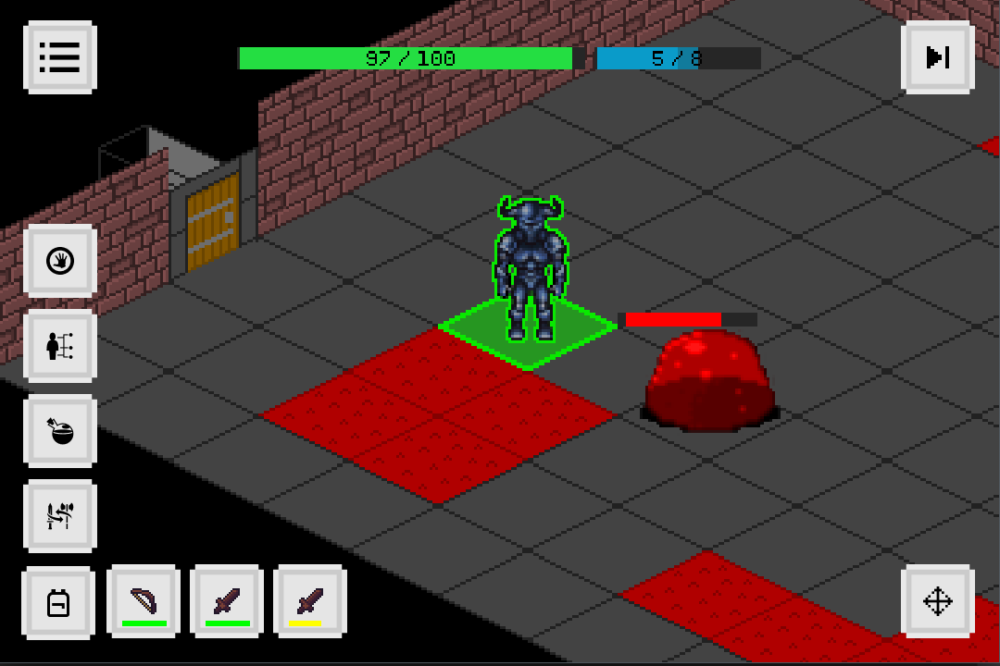

# Escape From Morasko
Turn based roguelike tactical game

Explore an underground dungeon filled with with vired environments. Fight monsters using action points in a turn based combat. Gather new items from hidden chests and defeated foes. Aquire new skills that give you new ways to fight and explore.

### Tools
- Kotlin programming language       : version 1.8.0   : https://kotlinlang.org/   : Apache License 2.0
- libgdx game development framework : version 1.11.0  : https://libgdx.com/       : Apache License 2.0
- JUnit testing framework           : version 4.13.2  : https://junit.org/junit4/ : Eclipse Public License 1.0
- Mockito mocking framework         : version 1.10.19 : https://site.mockito.org/ : MIT License

### Getting started
To work on this project you will need:
- an IDE (Intellij IDEA or Android Studio)
- JVM, JDK, JRE (from Intellij IDEA or Android Studio)
- android SDK and SDK tools (from Android Studio SDK Manager)
- android emulator (from Android Studio) or android device and USB

### Launching

Open in Intellij or Android Studio

Android launch option should be available once you open the project

To launch the desktop version go to desktop/src/com/efm/DesktopLauncher and run the main function

To run all the unit tests add a launch option:
- unwrap launch options
- select 'edit configuration'
- click '+' and 'gradle'
- give it a name like 'Unit Tests'
- in run select ':tests:test'

The most important files are in the 'core' module

### Overview

The main game class EscapeFromMorasko uses Screens to show main menu, game, settings, credits etc.  
Screens use UI elements from com.efm.widget building functions.kt.  
Game uses sound, music, font and texture Assets.  
Game state data is divided between different States, each holding its own relevant information.  
Game world data is stored in World class.  
World is divided into Levels and Levels are divided into Rooms.  
Rooms consist of Spaces, each corresponding to Map tile.  
Map is a set of tiles laid in layers.  
Space holds information about Base and Entity.  
Entity is a being occupying one Space.  
Entities can be Characters, that have health points, and Enemies, that move during Enemy turn and attack Hero.
Hero is Entity controlled by player.  
Hero can move on Map, interact with Interactive Entities, use Containers, Exits.  
Containers hold Items that Hero can store in Inventory.    
Items are divided into three main categories : MultiUseMapItems, StackableMapItems and StackableSelfItems.  
Beside Items, Hero can use Skills during combat.  
Skills can be Passive or Dynamic.  
Items and Skills trigger Animations that are executed on Map.  
Game world and state data can be serialised into json save files and then loaded into game again.  

### Screenshots

